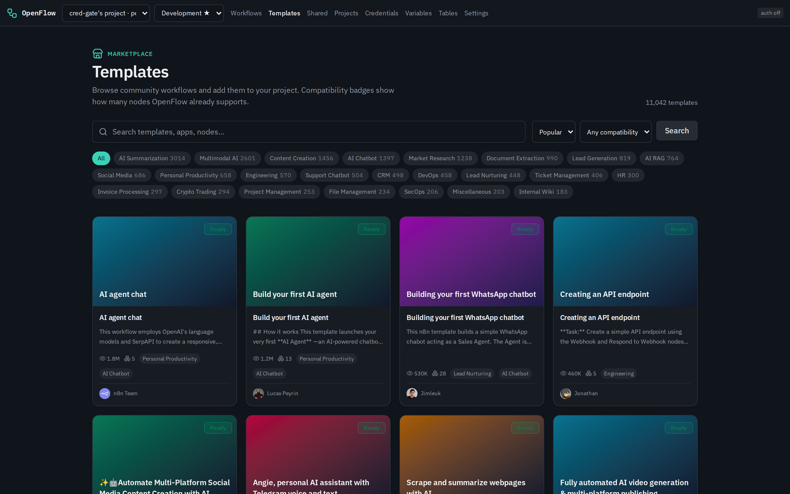
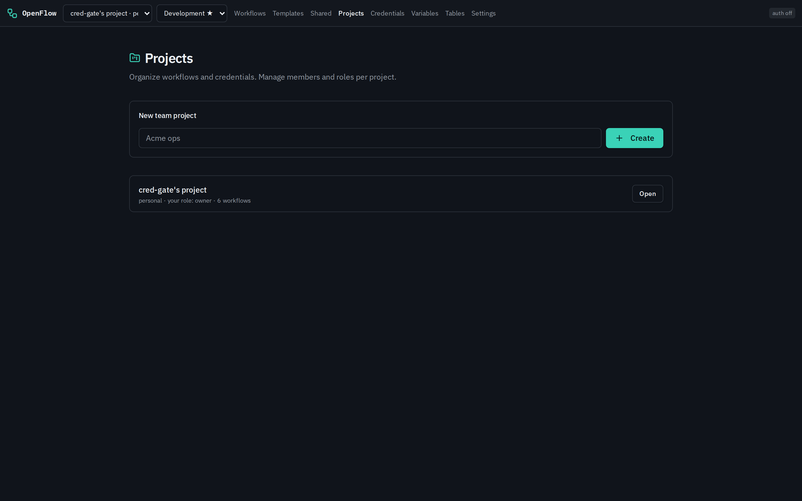
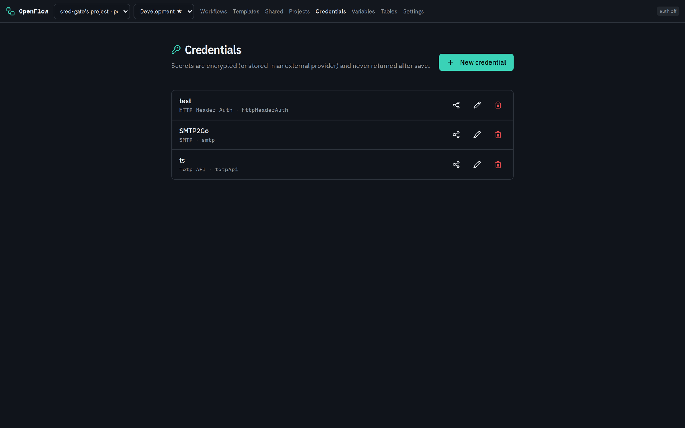

# OpenFlow

**Self-hosted workflow automation you own** — an independent open-source engine oriented toward **publicly documented, n8n-compatible workflow definitions**, built with a deliberate **clean-room** process so implementation is original project code, not a copy of third-party engine source.

This branch (`CORE`) is a **readme consensus**: why the project exists, how it was made, license and legal notes, and product screenshots. It is **documentation only** — not the application source tree.

| Doc | Purpose |
| --- | --- |
| [INSTALLATION.md](INSTALLATION.md) | Check out a product branch and run OpenFlow **in containers** |
| [LICENSE.md](LICENSE.md) | Apache License 2.0 |
| [LEGAL.md](LEGAL.md) | Independence, trademarks, why “n8n” is mentioned |
| [docs/screenshots/](docs/screenshots/) | Product captures used below |

| | |
|---|---|
| **License** | [Apache-2.0](LICENSE.md) |
| **Install / code** | Product branches ([`DEVELOPMENT`](https://github.com/real-limitless/OpenFlow/tree/DEVELOPMENT) · [`main`](https://github.com/real-limitless/OpenFlow/tree/main)) |
| **Marketing site** | [real-limitless.github.io/OpenFlow](https://real-limitless.github.io/OpenFlow/) |

---

## Screenshots

<p align="center">
  
</p>

<p align="center">
  <em>Visual editor · clean-room node factory · Docker-first self-host</em>
</p>

| Workflows | Templates | Editor |
| --- | --- | --- |
|  |  |  |

| Projects | Credentials |
| --- | --- |
|  |  |

More captions: [docs/screenshots/README.md](docs/screenshots/README.md).

---

## Why it exists

OpenFlow started from a simple need: **workflow automation you can run on your own infrastructure**, under a permissive license, without treating another product’s private source tree as a starting point.

Early choices rejected a managed-cloud-only backend. Real workflow execution needs long-running workers, persistent state, and control over the runtime — so OpenFlow ships as a **self-hosted** stack you operate yourself.

It also aims for **format interop** with publicly described, n8n-oriented workflow JSON (import / edit / export familiar shapes) while remaining an **independent** project. Mentions of n8n are for attribution and compatibility only — see [LEGAL.md](LEGAL.md).

---

## How it was made

OpenFlow grows node and engine coverage with a **clean-room factory**, assisted by AI models under strict process rules:

1. Study **public** documentation and publicly documented workflow shapes (not third-party engine source).
2. Capture behavior in written **spec files**.
3. Refine those specs through **multiple AI iterations** until the behavioral contract is solid.
4. Implement OpenFlow from those specs and the **OpenFlow Plugin SDK** in a **separate implement pass** that must not use third-party source as a reference.

```text
Public docs / public workflow JSON shapes
        │
        ▼  AI (spec half — public docs only)
  Behavioral SPEC files (per node / capability)
        │
        ▼  Multiple AI model iterations
  Refined, acceptance-oriented specs
        │
        ▼  AI (implement half — specs + OpenFlow SDK only)
  OpenFlow implementation (product branches)
```

| Phase | May use | Must not use |
| --- | --- | --- |
| **Spec** | Public product docs (e.g. docs.n8n.io), public workflow exports, this project’s own docs | Third-party **source** repositories or package source |
| **Implement** | Specs in this project, OpenFlow SDK, product-branch code | Third-party source as the implementer’s reference |

On product branches, the living pipeline includes per-node specs, agent prompts, factory tooling, and the Plugin SDK. This `CORE` branch only **describes** that process. Clean-room practice is a development method — **not** a legal warranty (see [LEGAL.md](LEGAL.md)).

---

## What you get (product branches)

- **Visual editor** — React Flow canvas, node palette, properties, execution history, optional AI assistant
- **Workflow JSON interop** — import / edit / export familiar public-format workflows (independent runtime)
- **Credentials & secrets** — encrypted vault, environments, variables, secret providers
- **Self-hosted stack** — Hono API, Prisma + Postgres, BullMQ + Redis workers
- **Plugin SDK** — `defineNode` authoring surface for builtins and future plugins
- **Templates** — marketplace browser with compatibility-minded import paths

**Stack:** TypeScript · React · TanStack Start · React Flow · Hono · Prisma · Postgres · BullMQ · Redis · Docker

Template and import features that help **n8n-oriented templates** work in OpenFlow are **adapters**, not a claim of ownership over third-party template content. Respect each template’s license.

---

## How OpenFlow runs (containers only)

**Supported for operators:** Docker, Podman, or another container engine **with Compose** (or the one-line installer that writes a Compose stack).

**Not a supported product runtime:** running the application on the host with Node/npm (`npm run dev`, host `node`, etc.).

```sh
# after checking out a product branch (see INSTALLATION.md)
docker compose up -d --build
# or: podman compose up -d --build
```

Open **http://localhost:3000**

Full steps, ports, production overlay, and one-line install: **[INSTALLATION.md](INSTALLATION.md)**.

---

## Branch model

| Branch | Audience | Contents |
| --- | --- | --- |
| **`CORE`** (this branch) | Everyone | Concept, methodology, license, legal notes, screenshots |
| **`DEVELOPMENT`** | Operators & developers | Active product: app, engine, Compose stack, TUI, specs, factory |
| **`main`** | Operators & developers | Product default / stable line as published on the remote |

```sh
git clone https://github.com/real-limitless/OpenFlow.git
cd OpenFlow
git checkout DEVELOPMENT   # full product — run via containers only
```

If you only see markdown and no `docker-compose.yml`, you are still on `CORE`.

### Private work

GitHub **cannot** hide individual branches on a public repository. For personal experiments or internal notes, use a **private fork** or **private sibling repository** — never push secrets or internal-only docs to this public remote.

---

## Who made it

**Chen Chiu** · Creator · [@real-limitless](https://github.com/real-limitless)

Independent open-source project under the real-limitless GitHub account — a self-hosted automation platform with a clean-room node factory so ownership of the runtime and the process stays with the people running it.

---

## Resources

| Link | Topic |
| --- | --- |
| [Product README (`main`)](https://github.com/real-limitless/OpenFlow/blob/main/README.md) | Full product docs on the code branch |
| [docs/install.md](https://github.com/real-limitless/OpenFlow/blob/main/docs/install.md) | Install / production notes |
| [SECURITY.md](https://github.com/real-limitless/OpenFlow/blob/main/SECURITY.md) | Secrets & vulnerability reporting |
| [CONTRIBUTING.md](https://github.com/real-limitless/OpenFlow/blob/main/CONTRIBUTING.md) | How to contribute on product branches |
| [Marketing site](https://real-limitless.github.io/OpenFlow/) | Product overview |
| [Issues](https://github.com/real-limitless/OpenFlow/issues) | Bugs and discussion |

---

## License

Apache License, Version 2.0 — [LICENSE.md](LICENSE.md).  
Attribution & trademarks — [LEGAL.md](LEGAL.md).

---

## Next steps

1. Read [LEGAL.md](LEGAL.md) (independence and n8n attribution).
2. Follow [INSTALLATION.md](INSTALLATION.md) — product branch + Compose/Podman.
3. On the product branch, run the container stack (optional host TUI only orchestrates containers).
