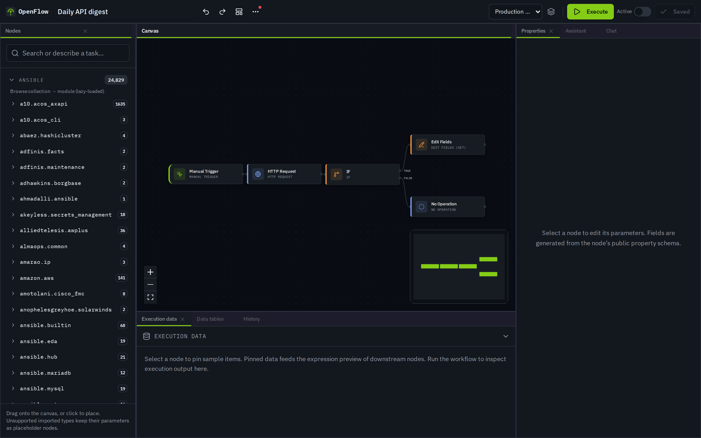
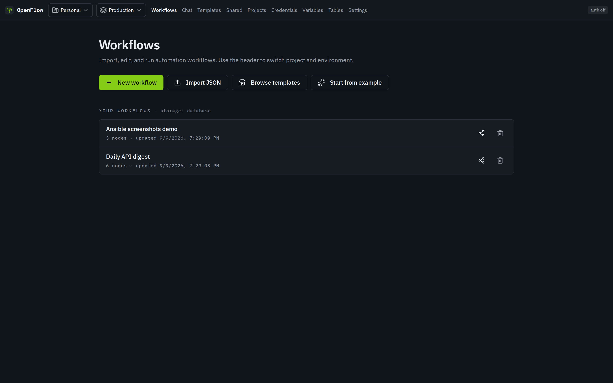

# OpenFlow

Self-hosted workflow automation engine, compatible with n8n workflow definitions.

**Marketing site:** [real-limitless.github.io/OpenFlow](https://real-limitless.github.io/OpenFlow/) · source in [`website/`](website/)

<p align="center">
  
</p>

<p align="center">
  <em>Visual editor · clean-room node factory · Docker-first self-host</em>
</p>

## Screenshots

| Workflows | Templates | Editor |
| --- | --- | --- |
|  |  |  |

More product shots (projects, credentials) live under [`website/assets/screenshots/`](website/assets/screenshots/). Regenerate with Playwright:

```sh
# App must be running (e.g. docker compose up -d or npm run dev)
npm run screenshots
```

## Quick start (Docker)

**Only Docker is required.** No Node.js, no manual database setup.

```sh
docker compose up -d
```

Open **http://localhost:3000**

First boot builds the image, starts Postgres + Redis + API, runs migrations, and generates a credentials key if you did not set one.

**First-run in the UI:** on the home page choose **Run sample workflow**, then **Execute** — the sample hits a public API and needs no credentials.

```sh
# logs
docker compose logs -f api

# stop
docker compose down
```

### One-line install (TUI)

```sh
curl -fsSL https://raw.githubusercontent.com/real-limitless/OpenFlow/main/scripts/get-openflow.sh | bash
```

Interactive menu (try-out / production / build-from-source / develop). Works under `curl | bash` by reading prompts from `/dev/tty`. Installs under `~/openflow` by default, waits for `/health/ready`, and opens a browser when ready.

```sh
# non-interactive try-out
curl -fsSL …/scripts/get-openflow.sh | bash -s -- --yes

# production (auth on → create owner on first open)
curl -fsSL …/scripts/get-openflow.sh | bash -s -- --yes --mode production

# build from source if the GHCR image is not published yet
curl -fsSL …/scripts/get-openflow.sh | bash -s -- --yes --mode build
```

`scripts/install.sh` remains a thin non-interactive wrapper around `get-openflow.sh --yes`.

### Production overlay

```sh
# set a strong CREDENTIALS_KEY in .env first
docker compose -f docker-compose.yml -f docker-compose.prod.yml up -d
```

Turns auth on by default, disables hot-reload, binds DB/Redis to localhost only. First open redirects to **Create instance owner**. Put TLS (Caddy/nginx/Traefik) in front before exposing to the internet. See [docs/install.md](docs/install.md).

---

## What you get

- **Visual editor** — React Flow canvas, node palette, properties, execution history, AI assistant
- **Workflow JSON interop** — import / edit / export familiar public-format workflows (independent clean-room runtime)
- **Credentials & secrets** — encrypted vault, environments, variables, secret providers
- **Self-hosted stack** — Hono API, Prisma + Postgres, BullMQ + Redis workers
- **Plugin SDK** — `defineNode` authoring surface for builtins and future plugins
- **Templates** — marketplace browser with compatibility badges

## Development

Requires **Node.js 22+** and Docker (for Postgres + Redis).

```sh
git clone https://github.com/real-limitless/OpenFlow.git
cd OpenFlow
npm run setup          # .env, deps, db/redis, migrations
npm run dev            # http://localhost:3000
```

Or use the interactive menu: `npm run tui`

| Script | What it does |
| --- | --- |
| `npm run setup` | First-time local setup |
| `npm run dev` | Vite + API (TanStack Start) |
| `npm run dev:api` | Hono API only |
| `npm run docker:up` | Full stack in Docker |
| `npm run db:migrate` | Prisma migrate (dev) |
| `npm run db:studio` | Prisma Studio |
| `npm run screenshots` | Capture README / marketing PNGs (Playwright) |

Copy `.env.example` → `.env` if you skip `setup` (it generates `CREDENTIALS_KEY` for you).

---

## Tech stack

- **Frontend**: React, TanStack Start, Tailwind CSS, React Flow
- **Backend**: Hono (API), Prisma (PostgreSQL), BullMQ (Redis)
- **Language**: TypeScript

## Project structure

```
src/
  server/         # Hono API server (routes, middleware)
  lib/            # Shared logic (workflow engine, node definitions, expressions)
  sdk/            # OpenFlow Plugin SDK (node authoring surface)
  components/     # React UI components
website/          # GitHub Pages marketing site + screenshots
prisma/
  schema.prisma   # Database schema
docs/
  install.md      # Install / production notes
  clean-room.md   # Clean-room rules
  sdk/            # SDK overview + non-goals
  specs/          # Per-node behavioral specs
scripts/
  capture-screenshots.mjs  # Playwright product + site captures
```

> `src/lib/workflow`, `src/lib/nodes`, `src/lib/expressions`, and `src/sdk` are framework-agnostic and contain no React imports.

## Clean-room node pipeline

1. Spec agent: `docs/prompts/01-spec-from-public-docs.md` → `docs/specs/nodes/*.md`
2. Implement agent (separate session): `docs/prompts/02-implement-from-spec.md` → SDK nodes
3. **OpenCode batches of 4:** `scripts/factory/README.md` + catalog `docs/specs/CATALOG.md`
4. **Hot-load (dev):** `POST /api/v1/dev/reload-nodes` when `OPENFLOW_HOT_NODES=1`
5. **Batch tests:** `npm run test:batch -- 00`
6. **Dogfood:** `npm run test:dogfood` · fixtures in `workflows/dogfood/` · `docs/dogfood.md`
7. **Factory:** `npm run factory:batch -- 05` · see `scripts/factory/README.md`
8. **Scrape → factory gaps:** `npm run factory:gaps` then `npm run factory:import-scraped -- enqueue --top 50`
9. **Template marketplace:** `npm run templates:sync` then open `/templates`

See `docs/clean-room.md` and `docs/sdk/OVERVIEW.md`.

## Website (GitHub Pages)

Static marketing site lives in [`website/`](website/) (no app build required). Product screenshots are under [`website/assets/screenshots/`](website/assets/screenshots/).

```sh
# preview marketing site locally
npx --yes serve website

# refresh screenshots (app on :3000 recommended)
npm run screenshots
```

**Deploy:** push to `main` (or run the *Deploy GitHub Pages* workflow). In the GitHub repo: **Settings → Pages → Source: GitHub Actions**. Live URL: `https://real-limitless.github.io/OpenFlow/`.

## Disclaimer

OpenFlow is an independent project. It is not affiliated with, endorsed by, or derived from any other product’s source code. Workflow type strings (for example `n8n-nodes-base.httpRequest`) are wire identifiers for interop only.
