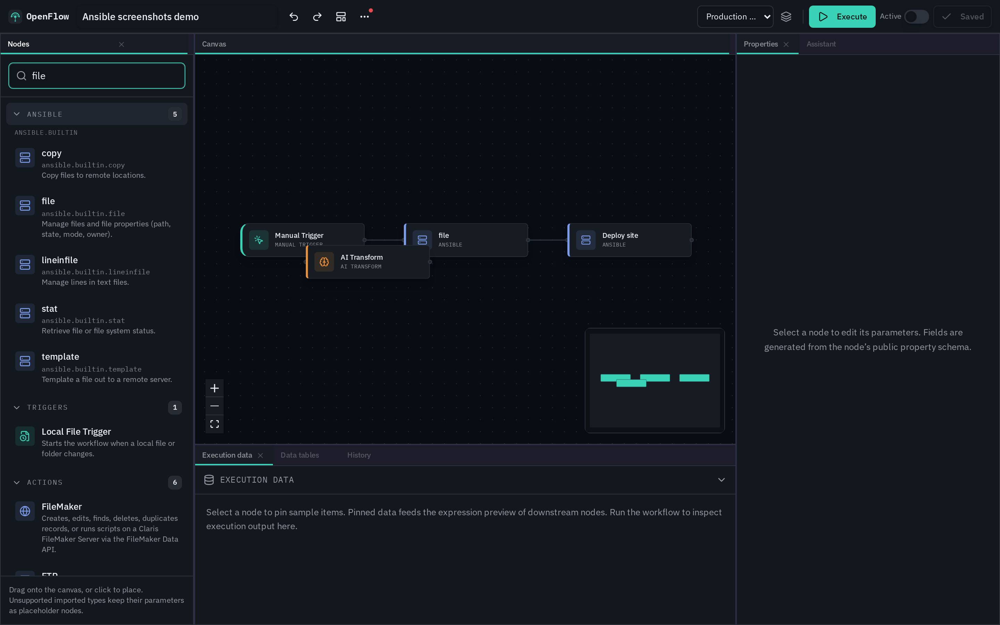
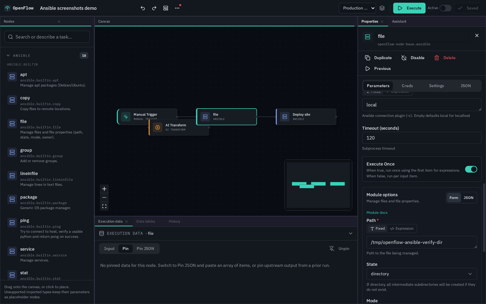
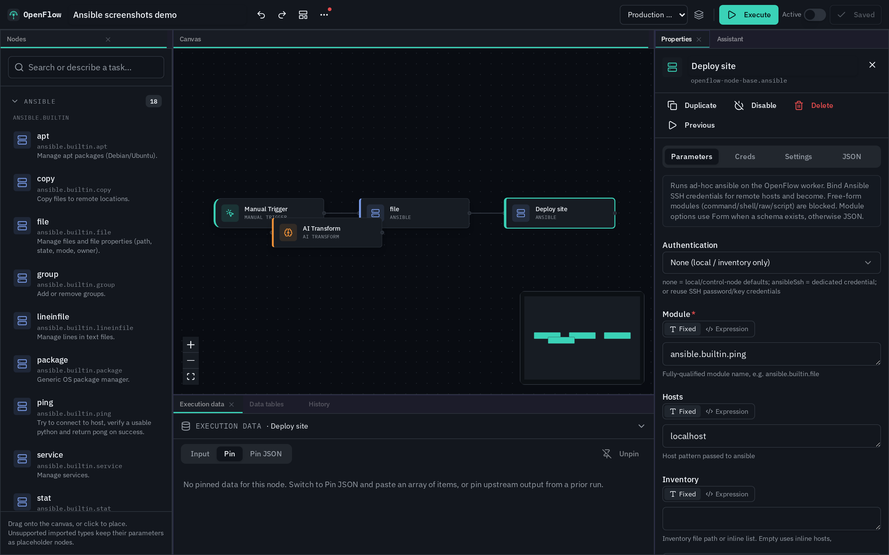
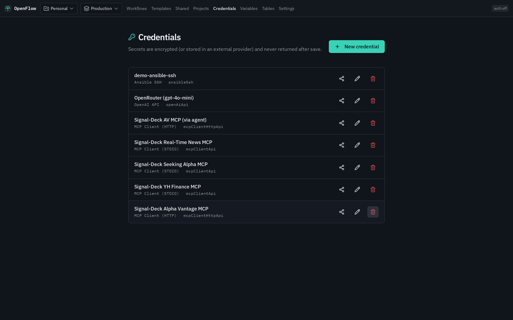
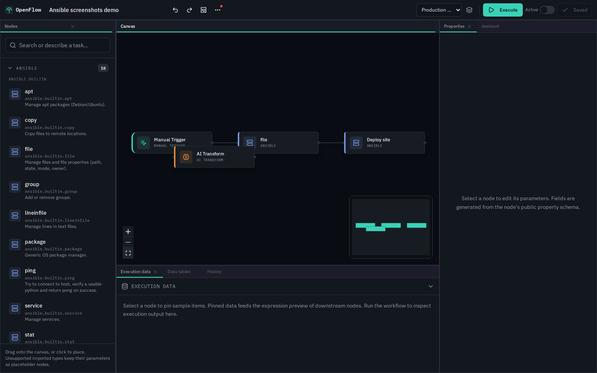

# OpenFlow

Self-hosted workflow automation engine, compatible with n8n workflow definitions. Run it with Docker in minutes, or develop on your machine with a guided install wizard.

## Choose your path

| Goal | What you need | Command |
| --- | --- | --- |
| **Try it** | Docker only | `docker compose up -d` → [http://localhost:3000](http://localhost:3000) |
| **Develop** | Node.js 22+, Docker | `npm run tui` → **Install wizard**, or `npm run setup && npm run dev` |
| **One-line install** | Docker | `curl -fsSL …/scripts/install.sh \| bash` (prebuilt GHCR image) |
| **Production-ish** | Docker + strong secrets | Compose prod overlay — see [docs/install.md](docs/install.md) |

**Preferred onboarding:** clone the repo and run the interactive manager:

```sh
git clone https://github.com/real-limitless/OpenFlow.git
cd OpenFlow
npm run tui
```

The **Install wizard** walks through path choice, prerequisites, `.env` / `CREDENTIALS_KEY`, optional auth & assistant key, dependencies, database, migrations, and a health check.

---

**Marketing site:** [real-limitless.github.io/OpenFlow](https://real-limitless.github.io/OpenFlow/) · source in [`website/`](website/)

<p align="center">
  
</p>

<p align="center">
  <em>Visual editor · clean-room node factory · Docker-first self-host · Ansible gallery</em>
</p>

## Screenshots

| Workflows | Templates | Editor |
| --- | --- | --- |
|  |  |  |

### Ansible on the canvas

| Gallery | Module Form \| JSON | Playbook |
| --- | --- | --- |
|  |  |  |

| SSH / become credentials | Dual-track architecture |
| --- | --- |
|  |  |

More product shots live under [`website/assets/screenshots/`](website/assets/screenshots/). Regenerate with **Playwright against a live app**:

```sh
npx playwright install chromium

# General product UI
APP_URL=https://your-openflow.example npm run screenshots

# Ansible gallery / form / playbook / credentials (real editor)
APP_URL=https://your-openflow.example npm run screenshots:ansible
```

## Quick start (Docker)

**Only Docker is required.** No Node.js, no manual database setup.

```sh
docker compose up -d
```

Open **http://localhost:3000**

First boot builds the image, starts Postgres + Redis + API, runs migrations, and generates a credentials key if you did not set one.

**First-run in the UI:** on the home page choose **Run sample workflow**, then **Execute** — the sample hits a public API and needs no credentials.

```sh
docker compose logs -f api   # logs
docker compose down          # stop (keep volumes)
```

### One-line install (TUI)

```sh
curl -fsSL https://raw.githubusercontent.com/real-limitless/OpenFlow/main/scripts/get-openflow.sh | bash
```

Interactive menu (try-out / production / build-from-source / develop). Works under `curl | bash` by reading prompts from `/dev/tty`. Installs under `~/openflow` by default, waits for `/health/ready`, and opens a browser when ready.

```sh
# non-interactive try-out
curl -fsSL …/scripts/get-openflow.sh | bash -s -- --yes

# production (auth on → create owner on first open)
curl -fsSL …/scripts/get-openflow.sh | bash -s -- --yes --mode production

# build from source if the GHCR image is not published yet
curl -fsSL …/scripts/get-openflow.sh | bash -s -- --yes --mode build
```

Installs under `~/openflow` by default (`OPENFLOW_HOME` to override). Until the image is published, use `docker compose up -d --build` from a clone instead.

### Production overlay

```sh
# set a strong CREDENTIALS_KEY in .env first
docker compose -f docker-compose.yml -f docker-compose.prod.yml up -d
```

Turns auth on by default, disables hot-reload, binds DB/Redis to localhost only. First open redirects to **Create instance owner**. Put TLS (Caddy/nginx/Traefik) in front before exposing to the internet. See [docs/install.md](docs/install.md).

---

## What you get

- **Visual editor** — React Flow canvas, node palette, properties, execution history, AI assistant
- **Workflow JSON interop** — import / edit / export familiar public-format workflows (independent clean-room runtime)
- **Credentials & secrets** — encrypted vault, environments, variables, secret providers
- **Self-hosted stack** — Hono API, Prisma + Postgres, BullMQ + Redis workers
- **Plugin SDK** — `defineNode` authoring surface for builtins and future plugins
- **Templates** — marketplace browser with compatibility badges
- **Ansible automation** — module gallery, hybrid Form|JSON args, playbooks, SSH/become credentials (see below)

## Ansible automation

Run **ad-hoc modules** or **playbooks** on the worker via `openflow-node-base.ansible` (and `ansibleTool` for agents).

| Capability | Detail |
| --- | --- |
| Gallery | Palette **Ansible** category — many cards, one runtime type |
| Module mode | FQCN + Form/JSON args; check mode; collection allowlist |
| Playbook mode | Path-jailed `.yml` + extra vars, limit, tags |
| Credentials | `ansibleSsh` (preferred) or SSH password/key + become |
| Security | No free-form `command`/`shell`/`raw`/`script`; argv-only CLI; redacted runData |
| Docker image | Includes `ansible-core` + `ansible.posix` / `community.general` / `community.docker` |

```sh
# Local dogfood (optional)
python3 -m pip install --user 'ansible-core>=2.16,<2.19'
export PATH="$HOME/.local/bin:$PATH"
ansible-galaxy collection install ansible.posix
npx vitest run src/lib/engine/__tests__/ansible*.test.ts
```

**Docs:** [docs/ansible.md](docs/ansible.md)  
**Side project (MCP for agents/IDEs):** [ansible-flow-mcp](https://github.com/real-limitless/ansible-flow-mcp) — same catalog/runner contract, stdio tools (`search_modules` → `run_module` / `run_playbook`).

---

## Development

Requires **Node.js 22+** and Docker (for Postgres + Redis).

```sh
git clone https://github.com/real-limitless/OpenFlow.git
cd OpenFlow
npm run setup          # .env, deps, db/redis, migrations
npm run dev            # http://localhost:3000
```

Or step through setup interactively: **`npm run tui`**.

| Script | What it does |
| --- | --- |
| `npm run tui` | Interactive menu + install wizard |
| `npm run setup` | First-time local setup (non-interactive) |
| `npm run dev` | Vite + API (TanStack Start) |
| `npm run dev:api` | Hono API only |
| `npm run docker:up` | Full stack in Docker |
| `npm run db:migrate` | Prisma migrate (dev) |
| `npm run db:studio` | Prisma Studio |
| `npm run screenshots` | Capture product / marketing PNGs (Playwright → live app) |
| `npm run screenshots:ansible` | Ansible gallery/form/playbook/creds (Playwright → live app) |

Copy `.env.example` → `.env` if you skip `setup` (it generates `CREDENTIALS_KEY` for you).

More detail: [docs/onboarding.md](docs/onboarding.md) · [docs/install.md](docs/install.md)

---

## First-run checklist

1. App responds at [http://localhost:3000](http://localhost:3000) (`GET /health` should be OK).
2. **Auth is off by default** (`AUTH_DISABLED=true`). Fine for local try-out — **not** for the public internet.
3. `CREDENTIALS_KEY` encrypts stored workflow credentials. Generated by `setup`, the TUI wizard, or the Docker entrypoint.
4. Optional: set `OPENFLOW_ASSISTANT_API_KEY` in `.env` for the editor AI assistant ([docs/assistant.md](docs/assistant.md)).
5. Optional Ansible: ensure worker has `ansible` + `ansible.posix` ([docs/ansible.md](docs/ansible.md)).

---

## Configuration

See [`.env.example`](.env.example) for the full list. Common variables:

| Variable | Notes |
| --- | --- |
| `AUTH_DISABLED` | `true` for local try-out; `false` for real deployments |
| `CREDENTIALS_KEY` | 64 hex chars; AES key for stored credentials |
| `DATABASE_URL` | Host dev uses `localhost:15432` |
| `REDIS_URL` | BullMQ queue (optional for some execute paths) |
| `OPENFLOW_ASSISTANT_*` | Editor AI assistant |
| `OPENFLOW_MCP_ENABLED` / `OPENFLOW_PUBLIC_URL` | Remote MCP + OAuth issuer ([docs/mcp.md](docs/mcp.md)) |
| `OPENFLOW_ANSIBLE_PLAYBOOK_ROOTS` | Extra colon-separated playbook path roots |

Deep install, S3/MinIO binary storage, logging, and production notes: [docs/install.md](docs/install.md).

---

## Security basics

- **Never commit `.env`** or real API keys. Only [`.env.example`](.env.example) is tracked.
- Rotate any secret that may have leaked — see [SECURITY.md](SECURITY.md).
- Local Compose uses Postgres password `openflow` — local-only, not for production.
- Before publishing a branch: `bash scripts/check-no-secrets.sh`
- Ansible free-form modules are denied by default; playbooks are path-jailed — see [docs/ansible.md](docs/ansible.md).

---

## Tech stack

- **Frontend**: React, TanStack Start, Tailwind CSS, React Flow
- **Backend**: Hono (API), Prisma (PostgreSQL), BullMQ (Redis)
- **Language**: TypeScript
- **Optional ops**: Ansible CLI on the worker for `openflow-node-base.ansible`

## Project structure

```
src/
  server/         # Hono API server (routes, middleware)
  lib/            # Shared logic (workflow engine, node definitions, expressions)
  lib/nodes/ansible/  # Gallery + module schemas (dual-track catalog)
  sdk/            # OpenFlow Plugin SDK (node authoring surface)
  components/     # React UI components
website/          # GitHub Pages marketing site + screenshots
prisma/
  schema.prisma   # Database schema
scripts/
  tui.sh          # Interactive manager + install wizard
  setup.sh        # Non-interactive first-time setup
  install.sh      # Docker one-line installer
  capture-screenshots.mjs
  generate-ansible-screenshots.mjs
docs/
  onboarding.md   # New developer guide
  install.md      # Install / production notes
  ansible.md      # Ansible node + dogfood
  clean-room.md   # Clean-room rules
  sdk/            # SDK overview + non-goals
  specs/          # Per-node behavioral specs
```

> `src/lib/workflow`, `src/lib/nodes`, `src/lib/expressions`, and `src/sdk` are framework-agnostic and contain no React imports.

---

## Contributing

See [CONTRIBUTING.md](CONTRIBUTING.md) and [docs/onboarding.md](docs/onboarding.md).

### Clean-room node pipeline

1. Spec agent: `docs/prompts/01-spec-from-public-docs.md` → `docs/specs/nodes/*.md`
2. Implement agent (separate session): `docs/prompts/02-implement-from-spec.md` → SDK nodes
3. **OpenCode batches of 4:** `scripts/factory/README.md` + catalog `docs/specs/CATALOG.md`
4. **Hot-load (dev):** `POST /api/v1/dev/reload-nodes` when `OPENFLOW_HOT_NODES=1`
5. **Batch tests:** `npm run test:batch -- 00`
6. **Dogfood:** `npm run test:dogfood` · fixtures in `workflows/dogfood/` · `docs/dogfood.md`
7. **Factory:** `npm run factory:batch -- 05` · see `scripts/factory/README.md`
8. **Scrape → factory gaps:** `npm run factory:gaps` then `npm run factory:import-scraped -- enqueue --top 50`
9. **Template marketplace:** multi-repo sources in `config/template-sources.json` (default: [n8n-workflow-library](https://github.com/real-limitless/n8n-workflow-library)). Add your own via `config/template-sources.local.json` or `OPENFLOW_TEMPLATE_SOURCES`, then `npm run templates:sync`. See `scripts/templates/README.md`.

See [docs/clean-room.md](docs/clean-room.md) and [docs/sdk/OVERVIEW.md](docs/sdk/OVERVIEW.md).

---

## Docs index

| Doc | Topic |
| --- | --- |
| [docs/onboarding.md](docs/onboarding.md) | New users & contributors |
| [docs/install.md](docs/install.md) | Install, Docker, production |
| [docs/ansible.md](docs/ansible.md) | Ansible modules, playbooks, credentials, dogfood |
| [SECURITY.md](SECURITY.md) | Secrets & reporting |
| [CONTRIBUTING.md](CONTRIBUTING.md) | How to contribute |
| [docs/assistant.md](docs/assistant.md) | Editor AI assistant |
| [docs/mcp.md](docs/mcp.md) | Remote MCP for third-party chatbots |
| [docs/clean-room.md](docs/clean-room.md) | Spec → implement pipeline |
| [ansible-flow-mcp](https://github.com/real-limitless/ansible-flow-mcp) | Standalone Ansible MCP server (dual-track) |
